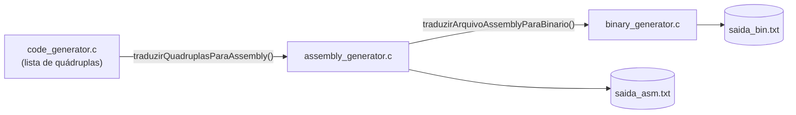
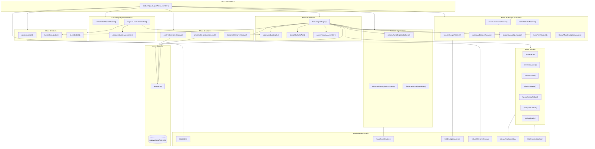
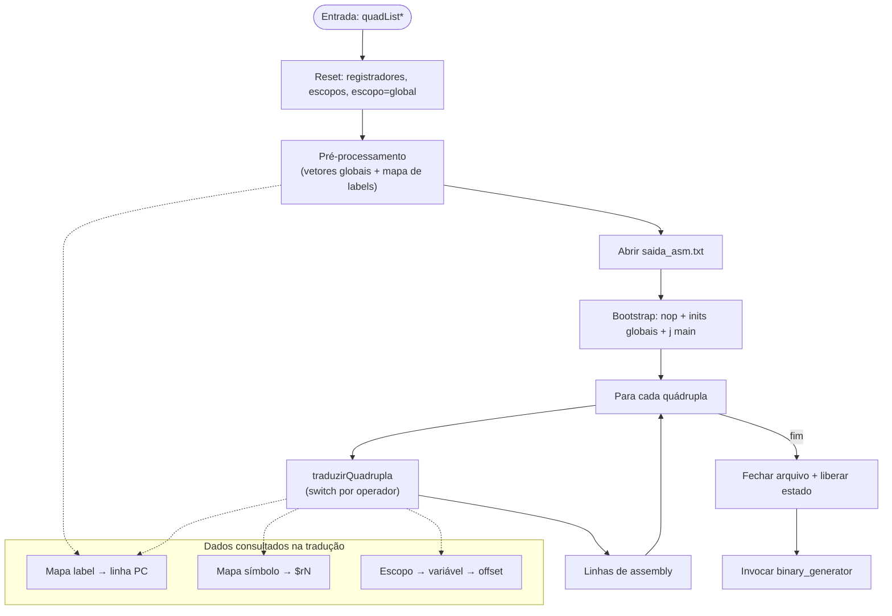
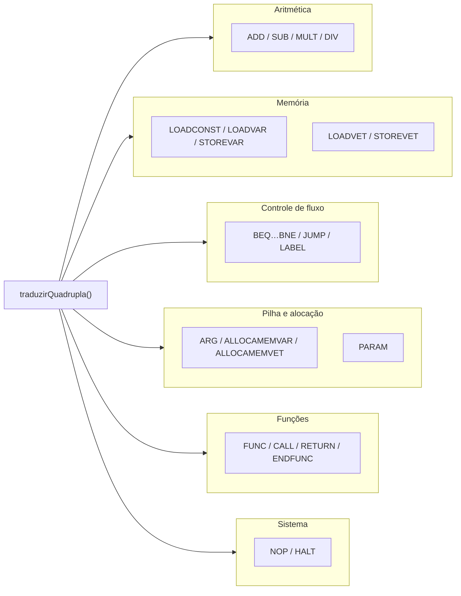

# Diagrama de Blocos — `assembly_generator.c`

Visão modular do gerador de assembly: blocos funcionais, estruturas de dados e dependências internas.

---

## 1. Contexto externo

---

## 2. Blocos internos

---

## 3. Fluxo de dados entre blocos

---

## 4. Bloco de tradução — casos de `traduzirQuadrupla`

---

## 5. Inventário de funções por bloco

| Bloco | Funções |
|---|---|
| Interface | `traduzirQuadruplasParaAssembly` |
| Pré-processamento | `coletarInitsVetoresGlobais`, `mapearLabelsParaLinhas`, `contarInstrucoesAssembly` |
| Tradução | `traduzirQuadrupla`, `operadorQuadrupla`, `branchOuSaltoAsm`, `nomeInstrucaoAssembly` |
| Labels | `adicionarLabel`, `buscarLinhaLabel`, `liberarLabels` |
| Registradores | `mapearParaRegistradorGeral`, `alocarIndiceRegistradorGeral`, `registradorExclusivo`, `liberarMapaRegistradores` |
| Escopo / variáveis | `buscarEscopoVariavel`, `adicionarEscopoVariavel`, `inserirVariavelNoEscopo`, `inserirVetorNoEscopo`, `buscarVariavelNoEscopo`, `baseParaEscopo`, `baseParaVariavel`, `liberarMapaEscoposVariaveis` |
| Vetores | `emitirInitsVetoresGlobais`, `emitirInitDescritorVetorLocal`, `liberarInitsVetoresGlobais` |
| Saída | `asmPrint` |
| Utilitário | `ehNumero`, `operandoValido`, `duplicarTexto`, `ehFuncaoMain`, `funcaoPossuiReturn`, `escopoEhGlobal`, `ehQuadrupla`, `emitirComentarioMemoria` |

| Estrutura | Papel |
|---|---|
| `LabelLinha` | Nome de label → linha assembly |
| `MapaRegistrador` | Temporário/símbolo → `$rN` |
| `VariavelEscopo` | Variável ou vetor com deslocamento na pilha |
| `EscopoVariavel` | Função ou global com lista de variáveis |
| `VetorGlobalInit` | Fila de inits de descritores globais |
