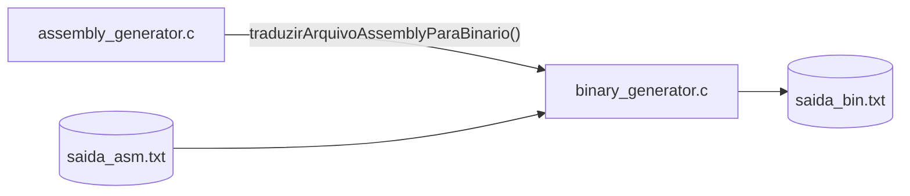
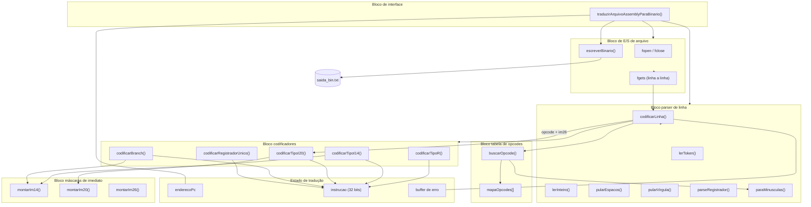
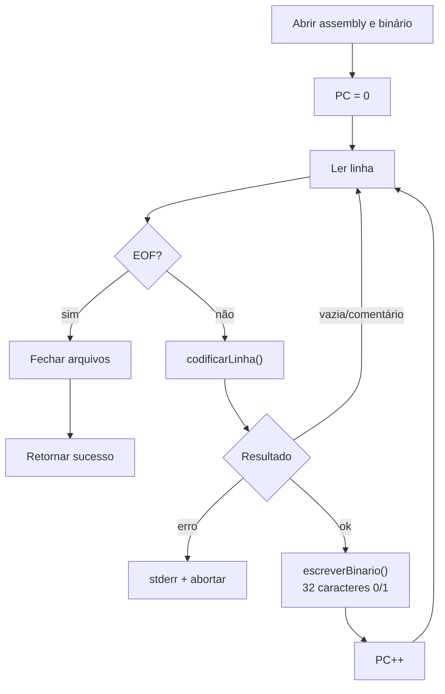
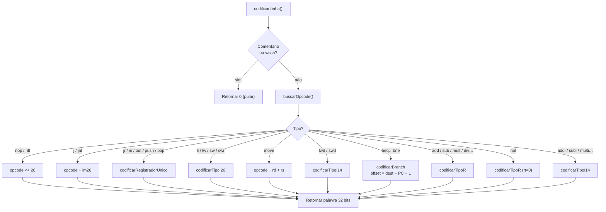
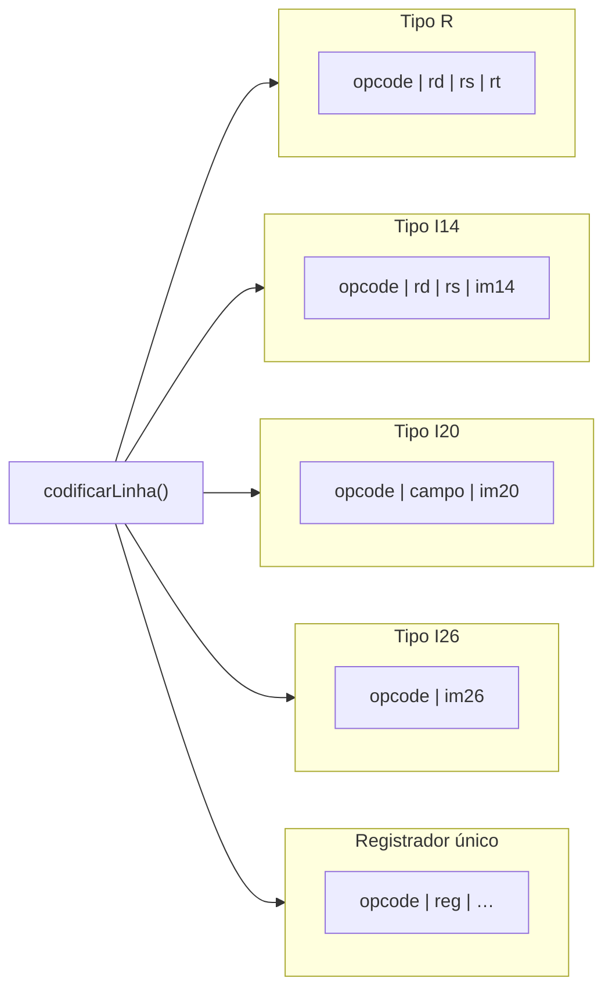

# Diagrama de Blocos — `binary_generator.c`

Visão modular do gerador binário: blocos funcionais, formatos de instrução e dependências internas.

---

## 1. Contexto externo

---

## 2. Blocos internos

---

## 3. Fluxo de dados entre blocos

---

## 4. Bloco `codificarLinha` — decisão por formato

---

## 5. Formatos de palavra de instrução

---

## 6. Inventário de funções por bloco

| Bloco | Funções |
|---|---|
| Interface | `traduzirArquivoAssemblyParaBinario` |
| E/S | `escreverBinario` (+ `fopen`, `fgets`, `fclose` na interface) |
| Parser | `codificarLinha`, `lerToken`, `lerInteiro`, `pularEspacos`, `pularVirgula`, `parseRegistrador`, `paraMinusculas` |
| Opcodes | `buscarOpcode`, `mapaOpcodes[]` |
| Codificadores | `codificarTipoR`, `codificarTipoI14`, `codificarTipoI20`, `codificarBranch`, `codificarRegistradorUnico` |
| Máscaras | `montarIm14`, `montarIm20`, `montarIm26` |

| Constante | Uso |
|---|---|
| `IM14_MASK` | Limita imediato de 14 bits |
| `IM20_MASK` | Limita imediato de 20 bits |
| `IM26_MASK` | Limita endereço de salto |
| `OPCODE_NOP_PADDING` | Padding especial do `nop` |

| Mnemônicos suportados (grupos) | Codificador |
|---|---|
| `nop`, `hlt` | word simples |
| `j`, `jal` | I26 |
| `jr`, `in`, `out`, `push`, `pop` | registrador único |
| `li`, `lw`, `lwr`, `sw`, `swr` | I20 |
| `move` | híbrido (rd + rs) |
| `lwd`, `swd` | I14 |
| `beq`, `bgt`, `blt`, `bge`, `ble`, `bne` | branch (I14 + offset relativo) |
| `add`, `sub`, `mult`, `div`, `and`, `or`, `sr`, `sl` | R |
| `not` | R (rt = 0) |
| `addi`, `subi`, `multi`, `andi`, `ori` | I14 |
