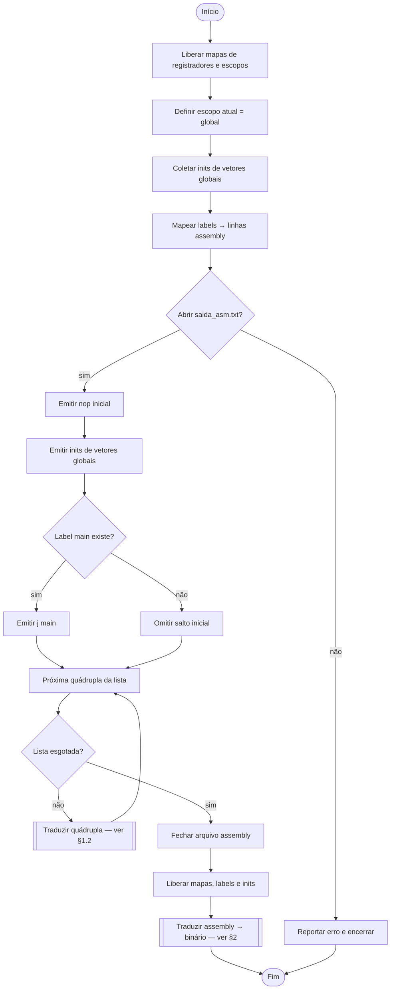
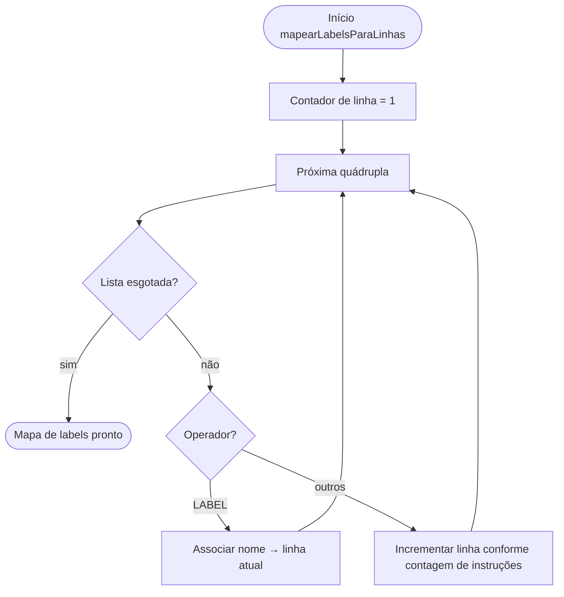
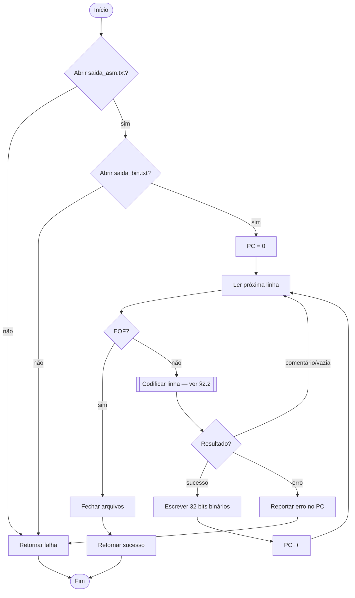
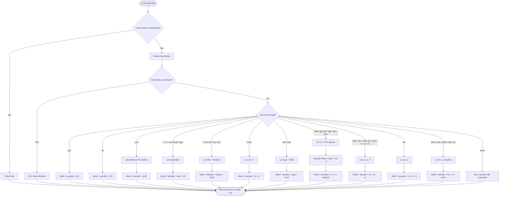

# Diagramas de Atividades UML — Gerador Assembly e Gerador Binário

Diagramas em alto nível do fluxo de tradução **quádruplas → assembly** (`assembly_generator.c`) e **assembly → binário** (`binary_generator.c`).

> Notação: retângulos = atividades; losangos = decisões; setas `[sim]` / `[não]` = ramificações.

---

## 1. Tradução de Quádruplas para Assembly

### 1.1 Visão geral — `traduzirQuadruplasParaAssembly`



### 1.2 Tradução de cada quádrupla — `traduzirQuadrupla`

Bloco de decisão principal: identifica o operador da quádrupla e executa a atividade correspondente.

```mermaid
flowchart TD
    start([Quádrupla recebida])
    endNode([Próxima quádrupla])

    start --> V{Quádrupla válida?}
    V -->|não| fail[Emitir quad bruta / falha]
    V -->|sim| op{Operador?}

    op -->|NOP| nop[Emitir nop]
    op -->|HALT| halt[Emitir hlt]
    op -->|LABEL| lbl[Registrar label → linha assembly]

    op -->|ADD| add{op2 é constante?}
    add -->|sim| addi[Emitir addi rd, rs, imediato]
    add -->|não| addr[Emitir add rd, rs, rt]

    op -->|SUB| sub{op2 é constante?}
    sub -->|sim| subi[Emitir subi rd, rs, imediato]
    sub -->|não| subr[Emitir sub rd, rs, rt]

    op -->|MULT| mul{op2 é constante?}
    mul -->|sim| multi[Emitir multi rd, rs, imediato]
    mul -->|não| mulr[Emitir mult rd, rs, rt]

    op -->|DIV| div[Emitir div rd, rs, rt]

    op -->|ARG| arg[Inserir parâmetro na pilha de variáveis]
    arg --> arg2[Emitir addi $sp, $sp, 1]

    op -->|LOADCONST| lc[Emitir li rd, constante]

    op -->|LOADVAR| lv[Buscar variável no escopo]
    lv --> lv2[Emitir lwd rd, base, offset]

    op -->|STOREVAR| sv[Buscar variável no escopo]
    sv --> sv2[Emitir swd rs, base, offset]

    op -->|BEQ / BGE / BGT / BLE / BLT / BNE| br[Resolver linha do label destino]
    br --> br2[Emitir branch rs, rt, destino]

    op -->|JUMP| jmp{Label destino existe?}
    jmp -->|sim| jmp2[Emitir j destino]
    jmp -->|não| jmp3[Omitir salto / comentário]

    op -->|ALLOCAMEMVAR| amv[Inserir variável no escopo]
    amv --> amv2{Escopo global?}
    amv2 -->|não| amv3[Emitir addi $sp, $sp, 1]
    amv2 -->|sim| amv4[Sem instrução]

    op -->|ALLOCAMEMVET| amvet[Inserir vetor no escopo]
    amvet --> amvet2{Tamanho ≥ 0 e escopo local?}
    amvet2 -->|sim| amvet3[Emitir addi $sp, $sp, tamanho]
    amvet3 --> amvet4[Emitir init do descritor local]
    amvet2 -->|não| amvet5[Sem reserva de pilha]

    op -->|LOADVET| lvet[Emitir lwd rd, endereço, 0]
    op -->|STOREVET| svet[Emitir swd valor, endereço, 0]

    op -->|PARAM| par[Emitir addi $sp, $sp, 1]
    par --> par2[Emitir swd argumento, $sp, 0]

    op -->|CALL| call{Função?}
    call -->|input| cin[Emitir in $rf]
    call -->|output| cout[Emitir lwd + out + subi $sp]
    call -->|usuário| cusr[Montar frame de chamada]
    cusr --> cusr2[addi / swd $fp / move $fp]
    cusr2 --> cusr3[Copiar PARAMs para frame]
    cusr3 --> cusr4[Emitir jal função]
    cusr4 --> cusr5[Restaurar $sp, $fp e pilha]

    op -->|FUNC| func[Atualizar escopo = nome da função]
    func --> func2{É main?}
    func2 -->|não| func3[Emitir swd $ra, $fp, 1]
    func2 -->|sim| func4[Pular save de $ra]
    func3 --> func5[Emitir addi $sp, $fp, 2]
    func4 --> func5

    op -->|RETURN| ret{Tem valor?}
    ret -->|sim| ret2[Emitir move $rf, rs]
    ret -->|não| ret3[Pular move]
    ret2 --> ret4{É main?}
    ret3 --> ret4
    ret4 -->|não| ret5[Emitir lwd $ra + jr $ra]
    ret4 -->|sim| ret6[Sem epílogo]

    op -->|ENDFUNC| ef[Restaurar escopo = global]
    ef --> ef2{Função sem return explícito?}
    ef2 -->|sim e ≠ main| ef3[Emitir lwd $ra + jr $ra]
    ef2 -->|não| ef4[Sem epílogo]

    op -->|outro| unk[Emitir quad bruta]

    nop --> endNode
    halt --> endNode
    lbl --> endNode
    addi --> endNode
    addr --> endNode
    subi --> endNode
    subr --> endNode
    multi --> endNode
    mulr --> endNode
    div --> endNode
    arg2 --> endNode
    lc --> endNode
    lv2 --> endNode
    sv2 --> endNode
    br2 --> endNode
    jmp2 --> endNode
    jmp3 --> endNode
    amv3 --> endNode
    amv4 --> endNode
    amvet4 --> endNode
    amvet5 --> endNode
    lvet --> endNode
    svet --> endNode
    par2 --> endNode
    cin --> endNode
    cout --> endNode
    cusr5 --> endNode
    func5 --> endNode
    ret5 --> endNode
    ret6 --> endNode
    ef3 --> endNode
    ef4 --> endNode
    unk --> endNode
    fail --> endNode
```

### 1.3 Pré-processamento — mapeamento de labels

Executado antes do loop principal, para resolver destinos de saltos e chamadas.



---

## 2. Tradução de Assembly para Binário

### 2.1 Visão geral — `traduzirArquivoAssemblyParaBinario`



### 2.2 Codificação de cada instrução — `codificarLinha`

Bloco de decisão por mnemônico assembly; cada ramo produz uma palavra de 32 bits.



### 2.3 Escrita da palavra binária — `escreverBinario`


---

## 3. Resumo — Quádrupla → Assembly → Binário

| Quádrupla | Assembly (resumo) | Binário (tipo) |
|---|---|---|
| NOP | `nop` | Tipo especial (padding) |
| HALT | `hlt` | opcode << 26 |
| LABEL | registro interno | — (não gera instrução) |
| ADD / SUB / MULT | `addi`/`add`, `subi`/`sub`, `multi`/`mult` | I14 ou R |
| DIV | `div` | R |
| ARG | escopo + `addi $sp` | I14 |
| LOADCONST | `li` | I20 |
| LOADVAR / STOREVAR | `lwd` / `swd` | I14 |
| BEQ…BNE | branch | I20 (offset relativo) |
| JUMP | `j` | I26 |
| ALLOCAMEMVAR | escopo + `addi $sp` (local) | I14 |
| ALLOCAMEMVET | escopo + `addi $sp` + init | I14 (+ seq. init) |
| LOADVET / STOREVET | `lwd` / `swd` offset 0 | I14 |
| PARAM | `addi $sp` + `swd` | I14 |
| CALL | frame + `jal` + teardown / `in` / `out` | misto |
| FUNC / RETURN / ENDFUNC | prologue / epilogue | I14, move, lwd, jr |
| *(linha assembly)* | — | codificada conforme mnemônico |

---

## 4. Referência de arquivos

| Módulo | Função principal | Saída |
|---|---|---|
| `assembly_generator.c` | `traduzirQuadruplasParaAssembly` | `saida_asm.txt` |
| `binary_generator.c` | `traduzirArquivoAssemblyParaBinario` | `saida_bin.txt` |
